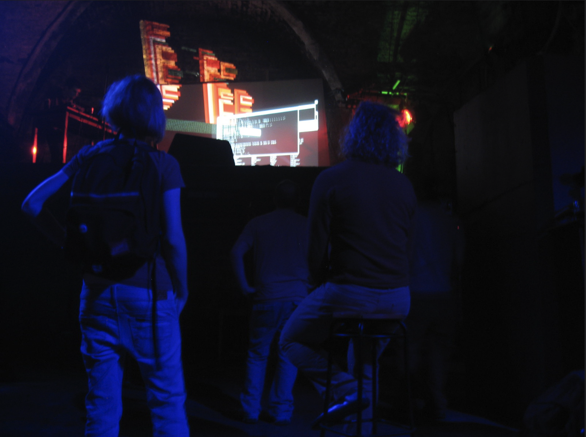
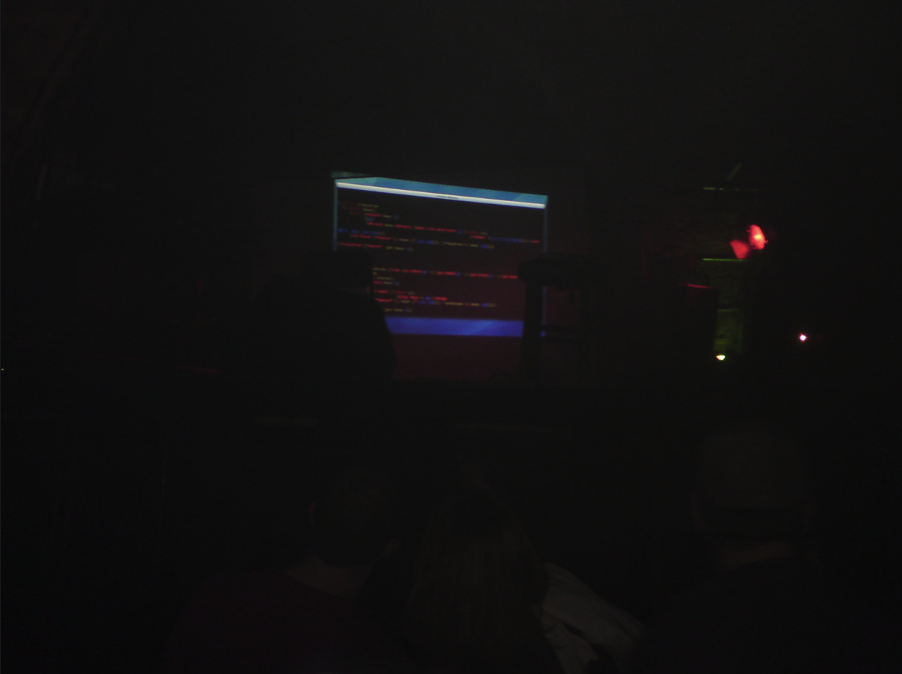

Initially this song was called '**Voices Slowly Talk To Me**' - then.. as usual.. I lost control of its direction! So I don't know anymore how much the title would apply. Anyways, it's my second experiment with recording an [Impromptu](http://impromptu.moso.com.au/) performance (by the way I also played it live the other night at the [Shunt](http://www.shunt.co.uk/) in London, with various mistakes and delays, but somehow I got to the end - thanks to the [toplap crew](http://toplap.org/uk/) for their support!).

## Livecoding practice: lessons learned

Somehow I'm becoming wiser with doing this type of stuff, you know, just trying to learn from past experiences. So here're a few tips I matured in the last weeks:

- **keep it simple**. Especially when playing live. Long and convoluted functions are a giant source of errors especially when you're a bit tense
- **use 'paste' templates**. Stuff like the _pb:cb_ function that comes by default with Impromptu. At the beginning I thought it wouldn't look too good, cause you've gotta show that you're coding the whole thing from scratch. But actually, **when you're livecoding** time is very very precious and what you want to focus on is **sound, primarily** (well at least this is what I like to do). It's also important to remember that many other environments for live performance are much much _higher level_ than Impromptu - meaning that it's quicker to emit sounds or musical structures and change their properties... so let's make sure we're not comparing apple and oranges here!
- **make variations often**. Even if they look stupid to you, change something, add another melody, double the drumkit, stuff like that. The audience is more interested in new audio-visual things happening that in seeing you code a Bach's prelude.
- **exercise a lot**. I initially felt weird about this, mainly because playing with Impromptu means coding, and when I code I usually take my time and think. But livecoding transforms the coding practice into a musical performance. Which means that you don't have time to think, **things should just come out automatically and sound good.** Only then you can take the freedom of 'jamming' without a plan. I play guitar, and that's exactly how it works there... I must have forgotten about it. When playing a song I can't lose time trying to remember how to lay out the fingers on the neck, that has to happen automatically.

That's it for now - I'll touch base again about this when the next live coding performance will happen! Rock on live-coders!
