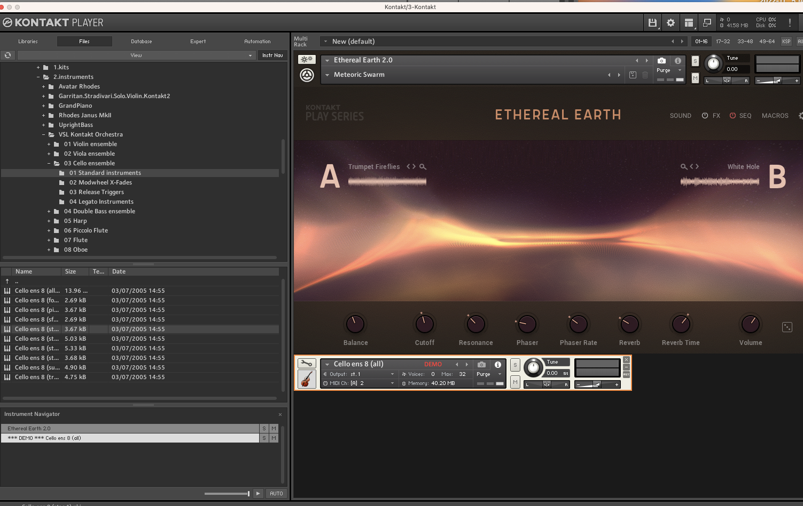
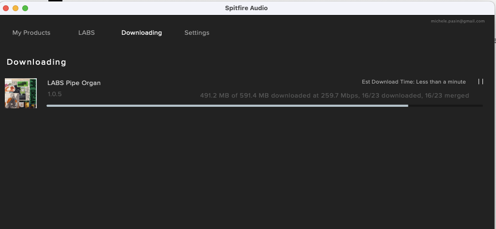

# Kontakt instruments

The default instruments are pretty good 

However if you open up any of mine in the `2.instruments` library, they go into DEMO mode 

~~The correct way is to open them up in Live directly.~~

It used to be possible to import them using Sample. But from [Live 11](https://help.ableton.com/hc/en-us/articles/115001134410-Supported-sample-formats) it is not possible to do that anymore..

See: [Kontakt Player Demo Mode – Explained](https://bedroomproducersblog.com/2020/04/23/kontakt-demo-mode/#:~:text=Question%3A%20Why%20do%20I%20see,the%20full%20version%20of%20Kontakt.)

> The “demo mode” means that you can only use the library for fifteen minutes. After that, there will be no sound on the output, and you won’t be able to access the editing features

Free libraries for Kontakt: 
- https://projectsam.com/libraries/the-free-orchestra/

# Spitfire Audio

- [main site](https://labs.spitfireaudio.com/)
- [installation](https://www.spitfireaudio.com/getting-started-labs) 

How to reset: 

Had occasionally to reset everything cause I was getting errors with instruments not being found, even after reinstalling them as per [error 4](https://spitfireaudio.zendesk.com/hc/en-us/articles/360006357354)

1. [delete everything](https://spitfireaudio.zendesk.com/hc/en-us/articles/4403731679121-How-do-I-Uninstall-a-Spitfire-Library-)
2. install app and log in 
3. the libraries installed previously may still appear. So you have to 
	* click on the library icon, select the cog, click on 'reset', 'reset entire library'
	* optionally, then reinstall it

This [youtube video](https://www.youtube.com/watch?v=1aM1pDguhlM) helps!

# Pianobook samples

Get the [Decent Sampler plugin](https://www.decentsamples.com/product/decent-sampler-plugin/)

Get an account on https://www.pianobook.co.uk/faq/

# Arturia Minilab

- [Overview](https://www.arturia.com/products/hybrid-synths/minilab-mkii/overview) 
- [Minilab and Logic](https://www.youtube.com/channel/UC42FCmmQtebb2AHSoBCq1Aw) 
- [Set up with Ableton](https://www.youtube.com/watch?v=CNmfXu6WkiA)
- [Ableton midi mappings via remote scripts](https://remotify.io/tutorials/midi-mapping-ableton-live#saving-midi-mappings)

PROS
nice keyboard
good quality
midi control works
knobs

CONS
no midi out 
no arpeggiator 

# Arturia Analog 4 Vs Analog 5

August 15, 2023: I have both of them installed 

> Analog Lab V (5) can play all Arturias sounds, including legacy sounds, if you have any.  
> Analog Lab 4 can't play the sounds from applications that's new in V-Collection 8. But perhaps you find the workflow and better for you, as things has changed from AL 4 to AL V.

* [Arturia Analog Lab 4 vs 5 (is it worth it to double install?)](https://forum.reasontalk.com/viewtopic.php?f=12&t=7528000&sid=b8deeb5a264c7477e2c0a392ef20b670)
* https://legacy-forum.arturia.com/index.php?topic=108084.0
* https://splice.com/blog/difference-between-v-collection-analog-lab/

# Akai MPK Mini Play

March 9, 2021: Editor does not work with OSx !!! 
- [Homepage](https://www.akaipro.com/mpk-mini-play-mpkminiplay)

# Launchkey Mini MK3

- [Getting-Started-With-Launchkey-Mini-MK3](https://support.novationmusic.com/hc/en-gb/articles/360009318600-Getting-Started-With-Launchkey-Mini-MK3)
- [update firmware](https://support.novationmusic.com/hc/en-gb/articles/360012823320)
- [Getting-Started-With-Launchkey-Mini-MK3-Ableton-Live-10-Setup](https://support.novationmusic.com/hc/en-gb/articles/360009288079-Getting-Started-With-Launchkey-Mini-MK3-Ableton-Live-10-Setup) 

March 9, 2021: returned / felt very cheap

# Logic Pro X

2021-03-14: tested and eventually gave up
TODO: write up article on blog to sum up the problems

- Logic Pro X: A Guide to Multitrack MIDI Recording
https://www.macprovideo.com/article/logic-pro/logic-pro-x-a-guide-to-multitrack-midi-recording
- Too many midi events
https://www.logicprohelp.com/forum/viewtopic.php?t=57319
- Playing midi instruments w/o selecting the track
https://www.logicprohelp.com/forum/viewtopic.php?t=128623
- IAC Driver, ports etc
https://www.logicprohelp.com/forum/viewtopic.php?t=121829
- Official help desc
https://support.apple.com/en-gb/guide/logicpro/lgcpbc10f1ea/mac#:~:text=%E2%80%9CMIDI%20data%20reduction%E2%80%9D%20checkbox%3A,only%20a%20few%20MIDI%20ports.
- Midi sustain 
https://www.reddit.com/r/Logic_Studio/comments/2lqv3q/midi_notes_sustain_indefinitely_anyone_else_ever/
- Generic Tutorial on Logic and Midi Controller
https://www.musicsequencing.com/article/controlling-logic-with-a-midi-controller
- Arturia Minilab support issues
https://forum.arturia.com/index.php?topic=93486.0

# Music Audio Visualizer

May 2, 2022

- [magic visuals](https://magicmusicvisuals.com/download) Seems nice but hard to get going with
- https://animusvisualizer.webflow.io/
- [Interesting thread](https://www.reddit.com/r/futurebeats/comments/a15a3d/realtime_music_visualizers/)
- https://lairdkruger.github.io/Audio-Visualizers/
- https://www.uberviz.io/
- Searching on google... [really hard to find anything!](https://www.google.com/search?q=music+visualizer+real+time)

