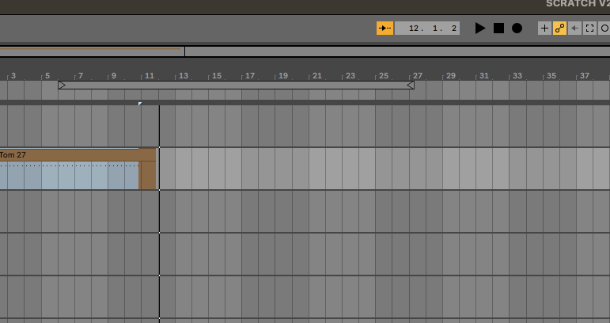
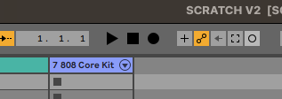
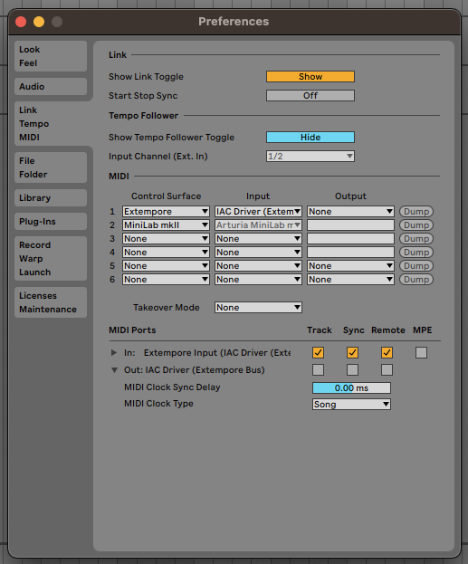
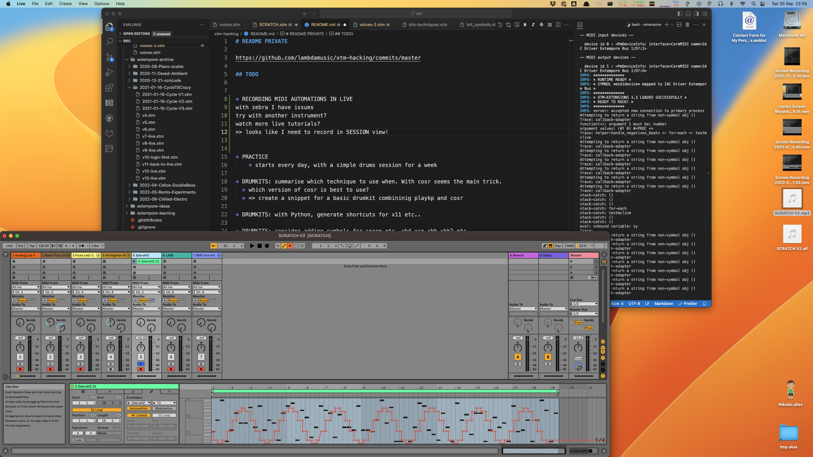

# Ableton Live

# MIDI setup with Extempore

MIDI Ports Input: 

* set up a new IAC driver 
* set Track and Remove inputs to true 
	* https://help.ableton.com/hc/en-us/articles/209774205-Live-s-MIDI-Ports-Explained 
* ready to go! (route extempore midi to that) and don’t activate MIDI Output at all

NOTE
channels a 1-based in Live, but are 0-based in Extermpore!!!

optionally create a control surface script (midi mappings)
=> https://help.ableton.com/hc/en-us/articles/209774285-Using-Control-Surfaces
PS Set only Input (not output) !!

Also: [EXTERNAL CONTROLLERS infos](https://www.musictech.net/guides/buyers-guide/best-controllers-ableton-live/)

# OSx Audio midi setup

* open up Audio Midi Setup app / Show Midi Studio
* double click on IAC driver and add a new entry called Extempore BUS ([more info](https://www.macosaudio.com/forums/viewtopic.php?f=7&t=11776))
* in LIVE make sure all INPUT sections in MIDI Sync / MIDI Ports are ON


# Midi CC and Automations

*2023-10-01*

## Arm the track 

From  'arrangement view' or 'session view'. 
Click on the automation arm button to ensure it's selected. 

Arm the track(s) you want to record on.

In Extempore, make sure you have MIDI CC mappings set up for the instrument you are using. 

Click on "Record"




*Note:* you'll always record in the arrangement view using this method. You can also record session clips, buy you need to select the Record Session button instead, and subsequently record an arrangements from the sessions




## Send Midi 

From Extempore

Eg

```scheme
(define channel 1)

; first set up the mapping as usual
; (:midicc 15 (random 1 100))


(define testmidicc
	(lambda (beat dur)

		;; play a note at each beat
		(at 1 0 (play channel C3 20 dur ))
		;; change CC every time the function runs
		(:midicc 15 (cosr (cosr 16 10 1/2) 5 .05))
	
	(callback (*metro* (+ beat (* 1/2 dur)))
		'testmidicc (+ beat dur) dur)))

(testmidicc (*metro* 'get-beat 1) 1/8)
```


You should see the MIDI CC effects in real time - eg if we mapped filter-1 to `Frequency` : 


## Stop recording

Always better to stop sending MIDI from Extempore first, to avoid strascichi di note. 

Once that is done, stop recording in Live. 

You should have a brand new clip in the armed tracks in the Arrangement view.


## Warning

Do not set the `Output` to IAC Driver! Leave it to `None`

This is both in the MIDI panel and the MIDI PORTS panel.

If not, the side effect, unexplained, is that Track recording seems to fail as the record button always switches back to inactive. 

Also, the recording of automations leads to unexpected results. 




## What automations look like 

In the MIDI editor they look like this




## See Also

- [How to Record Automation in Ableton Live](https://support.native-instruments.com/hc/en-us/articles/210313785-How-to-Record-Automation-in-Ableton-Live) 