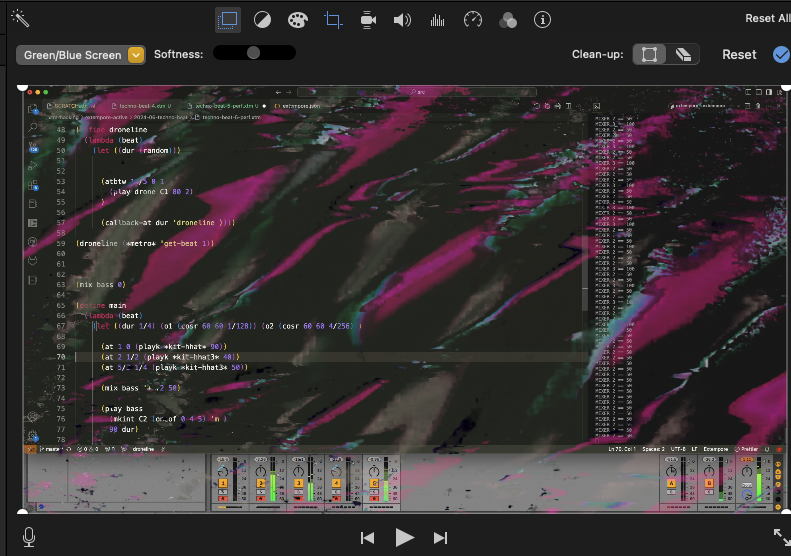

# iMovie

Tips on how to use Mac's iMovie to produce livecoding screencasts.

## Editing a screencast on a mac using iMovie

Often the audio I get from a screencast recording is rather weak. 

There's an easy way to fix that by using iMovie, which normally comes with any Mac. Here are the steps:

1. Open the livecoding video in iMovie
2. Detach Audio (right-click on movie bar to see the options menu)
3. Adjust the volume in the audio track editor, by dragging the mouse up/down (avoid red zones!)
	1. Additionally, you can try using the top left menu:   `Music Settings > Equalizer > Music Enhance`
4. Save the new movie:  `Share > File` 
	* Resolution: `720p 60`
	* Quality: `High` 
	* Compress: `Faster` 

**Results**: For a 10 mins video, that gives me a `.mp4` file of ~250M 

Upload to YouTube and off you go ;-)

## Adding backgrounds

I often use [Hydra](https://hydra.ojack.xyz/?sketch_id=mahalia_0) to create interesting backgrounds, and then overlay them on the livecoding video. 

1. Launch Hydra and pick some visuals you like
2. Save as local movie file (eg `.mov` using QuickTime and 'screen capture')
3. Import into iMovie

You can easily add [video overlay effects](https://support.apple.com/en-gb/guide/imovie-iphone/kna831efee4d/ios) in iMovie on a iOS device. In particular the **Green/Blue Screen** effect can be handy:

> Green/Blue Screen: Adds the clip so that during playback, the clip appears with the green-screen or blue-screen parts of the clip removed, and the remaining parts of the clip are superimposed on the main clip in the timeline.

First menu on the left:

