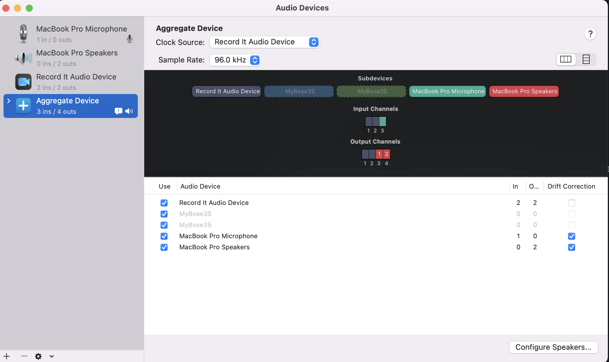

This post shows how to make a livecoding screencast using free OSX technologies. 

Capturing system audio and screen-recording your live coding performance can be done in multiple ways. Here's a method based on Apple's [Quicktime](https://en.wikipedia.org/wiki/QuickTime) and an audio plugin that is part of a third-party software, [Record It](https://www.buildtoconnect.com/en/products/recordit).

> Note: both of these software components are free.  The [Record It Audio Device](https://www.buildtoconnect.com/downloads/RecordItAudioDevice.pkg) which is a free extension that enables you to capture system sounds on your Mac. It acts as a virtual audio input device and sends the sound from music, videos, and system alerts that you would normally hear through your speakers to the input cha

## Recording a screencast: steps 

1.  Get the [Record It audio plugin](https://www.buildtoconnect.com/help/how-to-record-system-audio) PS this is a free audio extension, even if it is part of a paid-for software ([RecordItAudioDevice.pkg](https://www.buildtoconnect.com/downloads/RecordItAudioDevice.pkg))
	1. Install it by right-clicking on app and selecting 'Open...' to avoid the permissions issue
2. On AudioMidi Setup, [Create an Aggregate Device to combine multiple audio interfaces](https://support.apple.com/en-us/HT202000)
	1. Increase sample rate to 96hz, if necessary (Ensure it's done before opening LIVE)
3. Open Quicktime and [set it to record your screen](https://support.apple.com/en-us/HT208721), making sure you get audio from the RecordIt audio plugin
4. Set your DAW (eg Ableton Live) to output audio to RecordIt
5. Set your computer to output sound to the Aggregate Device (so that you can also hear what's going on e.g. if you are using headsets)

DONE!

## Post-processing tips

Often the audio I get from a Quicktime screencast recording is rather weak. 

I found an easy way to fix that by using iMovie, which normally comes with any Mac. Here are the steps:

1. Open the livecoding screencast  in iMovie
2. Detach Audio (right-click on movie bar to see the options menu)
3. Adjust the volume in the audio track editor, by dragging the mouse up/down (avoid red zones!)
	1. Additionally, you can try using the top left menu:   `Music Settings > Equalizer > Music Enhance`
4. Save the new movie:  `Share > File` 
	* Resolution: 720p 60
	* Quality: High 
	* Compress: Faster 

**Results**: For a 10 mins video, that gives me a `.mp4` file of ~250M 

Upload to YouTube and off you go ;-)
