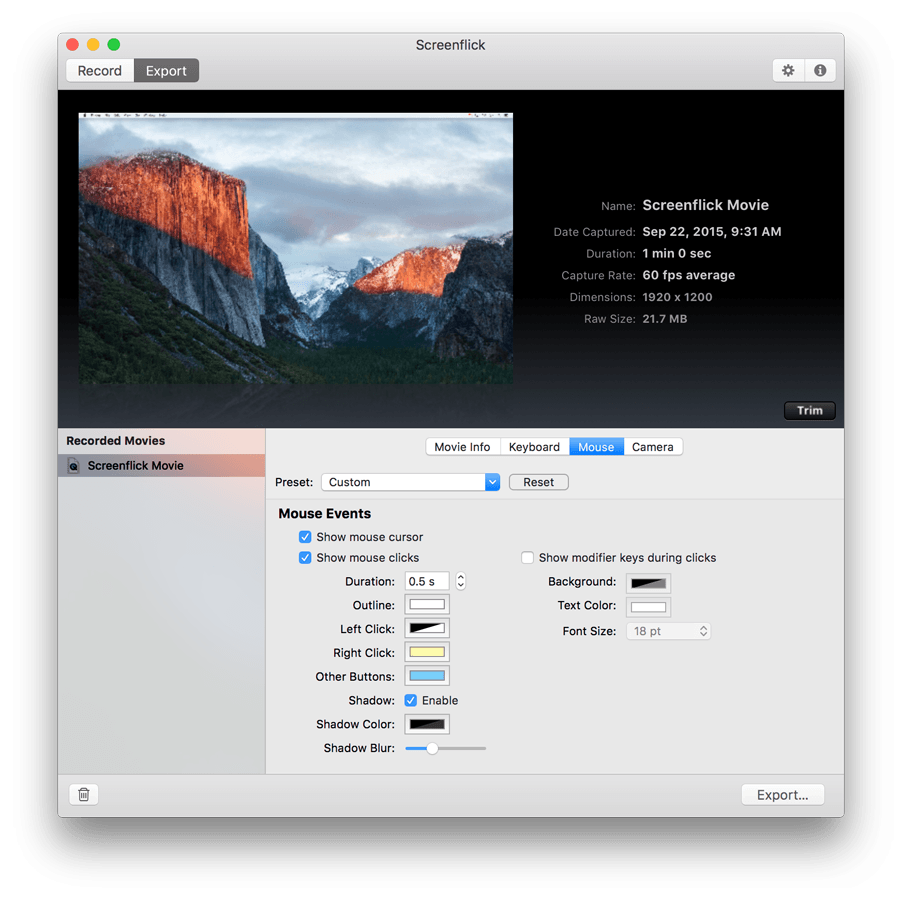

# Screencast with Screenflick (legacy)

[https://www.araelium.com/support/screenflick](https://www.araelium.com/support/screenflick)

*  When you start a recording with system audio turned on, Screenflick switches the system-wide default audio output device to the "Soundflower" virtual audio device, which Screenflick then uses as an input to record audio from. 
* Some programs unfortunately will play all audio over a specific output device determined when the application launched rather than always using the current system setting which can lead to problems like this.
* What needs to happen is the program playing audio needs to decide that it should play that audio to the Soundflower device, rather than your speakers. There are two ways this can happen.
 	1.	Launch the program which plays the audio after you start a Screenflick recording. (The system output device will be Soundflower and the program will therefore use it.)
 	2.	Before starting the program, go into System Preferences and change the system output audio device to "Soundflower (2ch)" manually, start the program which will play audio, and then start the recording in Screenflick when you're ready. (After the recording ends, don't forget to change the system output device back to your speakers.)
	[BEST]
	 3.	A third option which doesn't always exist, is that the program playing audio may have a preference setting for which audio device to play audio to. Check the program's preferences just in case. If it does have a setting, set it to "Soundflower (2ch)" while recording.

My own tips:
- FPS 15  
	- Seems to lead to less MIDI delays 
	- Frames not an issue cause it's just screen recording
Then **export** to Qtime
- Audio 128 Kbps
- All other options default
	- Changing framerate seem to have no effect 

