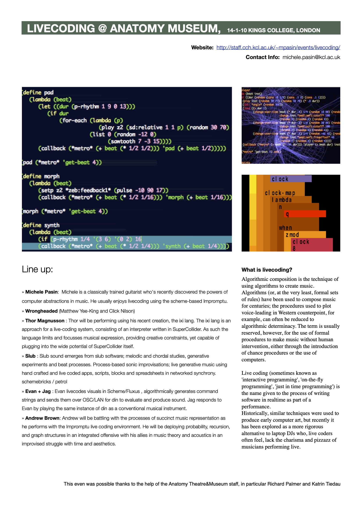

Livecoding @ Anatomy Theatre, King's College, London. 

**Untitled 12** is an electronic music experiment mixing a standard bassline with randomly generated synth sounds. 

<iframe width="560" height="315" src="https://www.youtube.com/embed/8GHclRJAoE0?si=MtvtP9jRvA3O65KE&autoplay=1&amp;start=340" title="YouTube video player" frameborder="0" allow="accelerometer; autoplay; clipboard-write; encrypted-media; gyroscope; picture-in-picture; web-share" allowfullscreen></iframe>

Finally I managed to shrink down to a reasonable size and upload the video recording from our last [livecoding event at Kings College](http://www.michelepasin.org/blog/2010/01/10/livecoding-night-kings-college-coming-up/).

Hopefully the other people will be uploading theirs too some time soon .. Here's my piece titled **Untitled 12**: 

## The program

