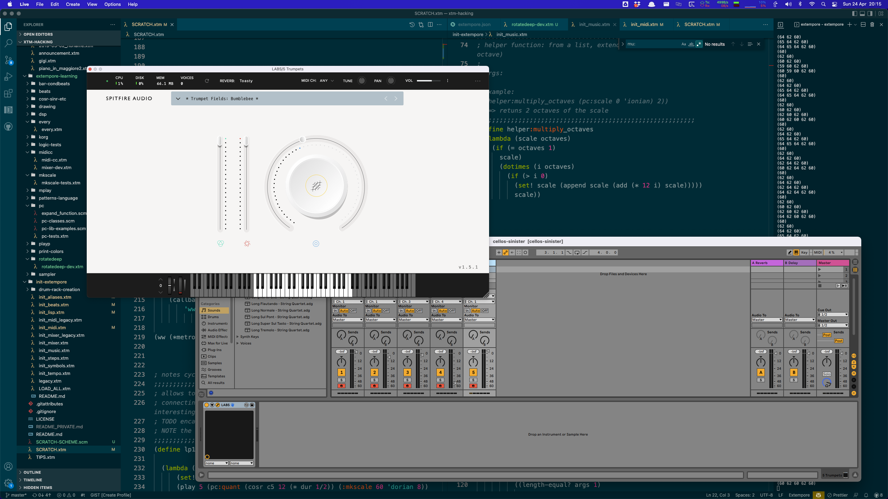
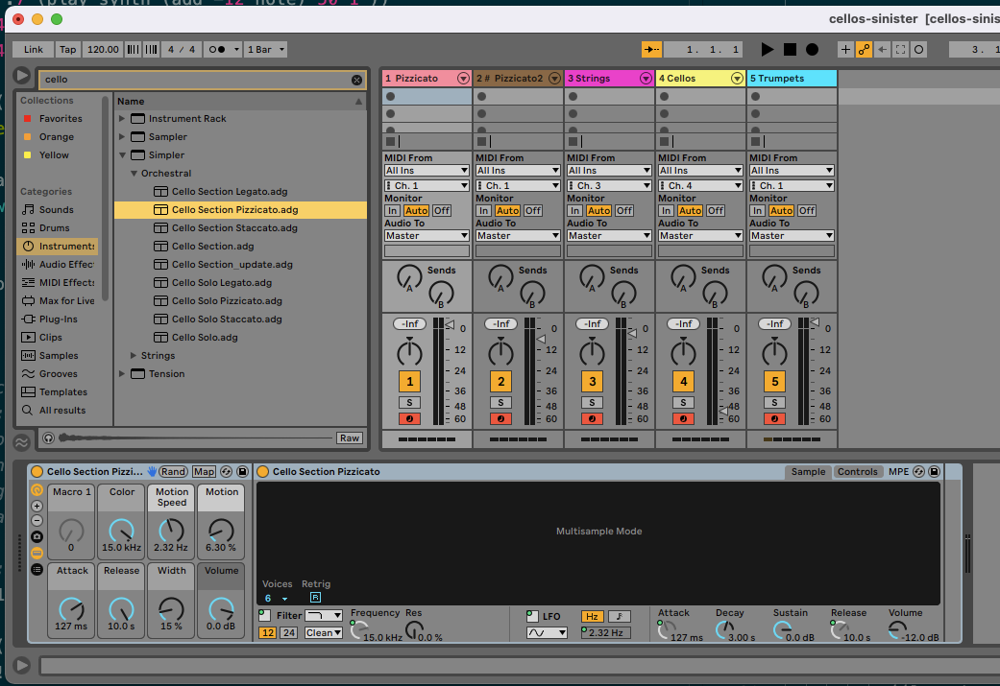
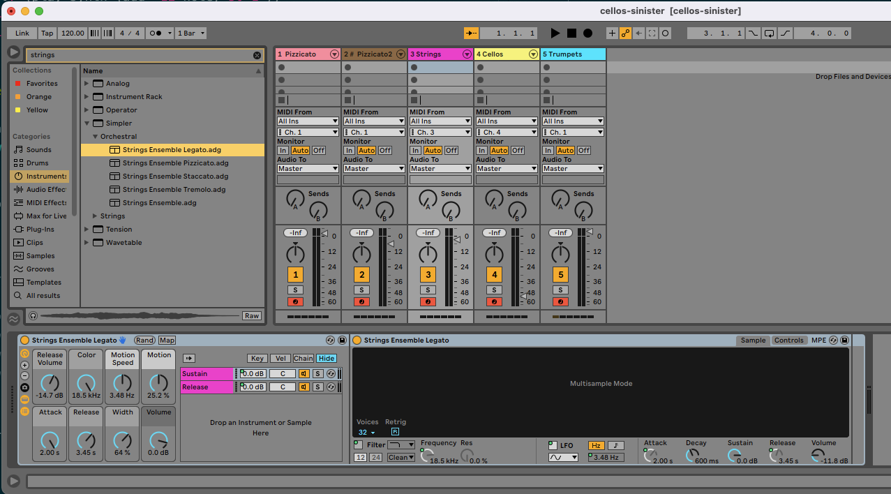

A new livecoding composition using [Extempore](https://extemporelang.github.io/) and Ableton Live: 'Study for Cello and Double-bass'. 

<iframe width="560" height="315" src="https://www.youtube.com/embed/VR6lMsECEQc" title="YouTube video player" frameborder="0" allow="accelerometer; autoplay; clipboard-write; encrypted-media; gyroscope; picture-in-picture" allowfullscreen></iframe>

## Creating chords using a cosine function

The main technique used in this piece is to generate chord/harmonic variations using a cosine functions. 

```scheme
(at 8 0 
  (set! *melody* 
    (:mkchord (:mkint 48 (cosrfloor 7 7 1/30) 'M)   
    'M (cosrfloor 7 3 1/5))
  )
```

Every 8 beats the root chord (used by all instruments in order to generate musical patterns) gets updated. Two cosine functions are used to simultaneously: 

1. Determine the *amplitude* of the interval (major or minor, starting from C3) that generates the root note of the chord.
2. Determine the number of notes in the chord. 

The two cosine functions have different frequencies, leading to a variety of combinations of chord shapes that keep cycling around. 

## The sounds I used

Sounds are generated by sending MIDI events to [Ableton Live 11](https://www.ableton.com/en/live/what-is-live/).  I'm using two main virtual instruments:

- [Simpler](https://library.berklee.edu/knowledge-base/simpler-vs-sampler-everything-you-need-know) built-in presets
- [Spitfire Audio LABS](https://labs.spitfireaudio.com/#type=&search=&new=true)








## Full source code

```scheme

(define *melody* (mkchord 48 '-))
(define *durs* (list 1/2 1/2 1 1/2))

(define loop
  (lambda (beat melody durs)
    (let ((dur (car durs)) 
          (p (car melody)))

        (at 8 0 
          (set! *melody* 
            (:mkchord (:mkint 48 (cosrfloor 7 7 1/30) 'M)   
            'M (cosrfloor 7 3 1/5))
          )

          (play cello (octave (car *melody*) 3 4) 60 8 )
          (play 2 strings (octave (:mkint (car *melody*) 3 'M) 7 9) 50 8 )
          (play 5/2 strings (octave (:mkint (car *melody*) 5) 3 5) 40 6 )
          (play 4 strings (octave (:mkint (car *melody*) 12) 7 9) 30 4 )
        ) 


        (play pluck p 60 (* dur .9) )
        (play 3/2 pluck (add -12 p) 60 (* dur .9) )

      (at 4 0 
        (play pluck (:mkint p (oneof 12 4 5) ) 50 (* dur 2) )
        (play (oneof 1 1/2) pluck (:mkint p 24 ) 40 (* dur 2) )
      )

      (callback (*metro* (+ beat (* 1/2 dur))) 
        'loop (+ beat dur)
        (cdr-or-else melody *melody*)
        (cdr-or-else durs *durs*)))))

(loop (*metro* 'get-beat 1) *melody* *durs*)

```

Also available on [GitHub](https://github.com/lambdamusic/The-Musical-Code/blob/main/works/2022-04-study-cello-double-bass.xtm).