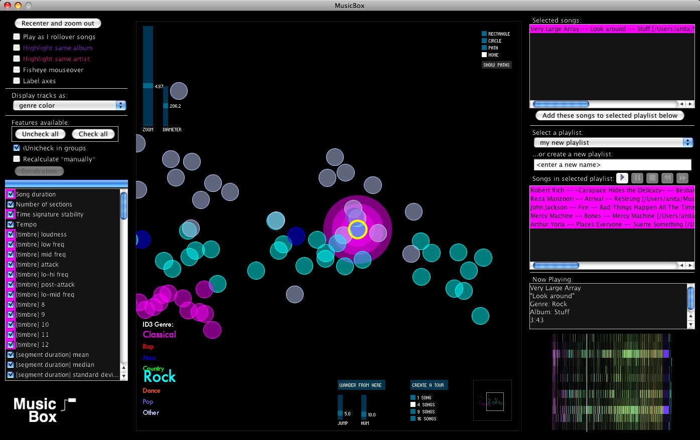

MIT student [Anita Lillies](http://thesis.flyingpudding.com/) shows off her project Music Box:

{width=70%}

## Video demo

<iframe width="560" height="315" src="https://www.youtube.com/embed/OPbdQ80VkyQ" title="YouTube video player" frameborder="0" allow="accelerometer; autoplay; clipboard-write; encrypted-media; gyroscope; picture-in-picture" allowfullscreen></iframe>

