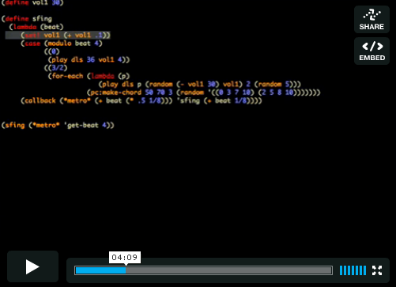

 ...

I finally managed to find time to play more seriously with the fantastic [impromptu](http://impromptu.moso.com.au/) - here's a first **screencast**, it doesn't sound _that_ good but it made my day! (and maybe it'll help others better understand how impromptu works..)

p.s. I'm intending to start posting more stuff about impromptu (e.g. little libraries and code samples), stay tuned!
