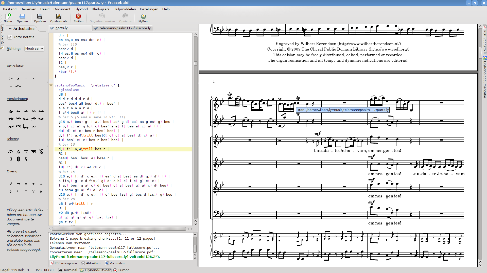

[LilyPond is a free piece of software](http://lilypond.org/web/index) for generating nice musical sheets from specifications written on a text file. 

# Background

> The inspiration for LilyPond came when two befriended musicians got annoyed with the bland and boring look of computer print-outs. Every musician prefers reading beautiful music, so couldn't we programmers solve that printing problem?
> 
> LilyPond just does that: it prints music in the best traditions of classical engraving with minimum fuss. Don't waste time on tuning spacing, moving around symbols, or shaping slurs. Impress friends and colleagues with sharp sheet music!

Pretty cool uh?

I tried Lilypond for a little, it's pretty impressive, and the language used for creating the tablatures didn't seem too hard to master (it'd be really cool to create that on-the-fly while using Impromptu). The [how-to page](http://lilypond.org/web/switch/howto) gives a crash course on how to create good-looking music, such as how to express notes and durations:

