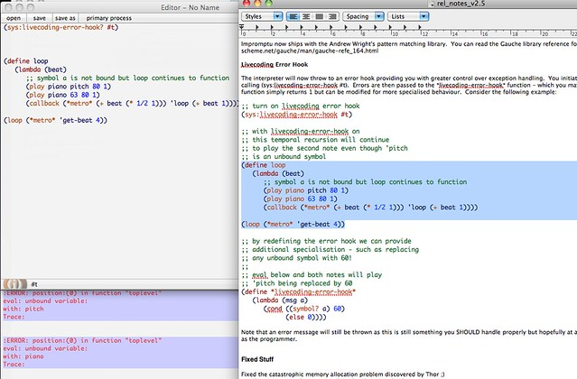

[Impromptu 2.5](http://impromptu.moso.com.au/) has been out for a while now but I've never realised it contained this new handy feature: an 'error hook':

> The interpreter will now throw to an error hook providing you with greater control over exception handling. You initiate the livecoding error hook by calling (sys:livecoding-error-hook #t). Errors are then passed to the \*livecoding-error-hook\* function - which you may rebind. By default the function simply returns 1 but can be modified for more specialised behaviour.

This is extremely useful, to say the least, if you are performing live and want to avoid situations in which a (stupid) typo or parenthesis error will mess up your entire gig. The error hook in many cases will prevent your looping function from crashing, giving you time to fix the error. Really neat.

[](http://www.flickr.com/photos/mikele/6619819815/ "Impromptu: livecoding error hook by MagIcReBirth, on Flickr")

Here's an example from the official release notes:

```scheme
;; turn on livecoding error hook
(sys:livecoding-error-hook #t)

;; with livecoding-error-hook on   
;; this temporal recursion will continue
;; to play the second note even though 'pitch
;; is an unbound symbol
(define loop
   (lambda (beat) 
      ;; symbol a is not bound but loop continues to function
      (play piano pitch 80 1)
      (play piano 63 80 1)
      (callback (*metro* (+ beat (* 1/2 1))) 'loop (+ beat 1))))

(loop (*metro* 'get-beat 4))

;; by redefining the error hook we can provide
;; additional specialisation - such as replacing
;; any unbound symbol with 60!
;; 
;; eval below and both notes will play
;; 'pitch being replaced by 60
(define *livecoding-error-hook* 
   (lambda (msg a) 
      (cond ((symbol? a) 60)
            (else 0))))

```

Happy (and safer) livecoding!
