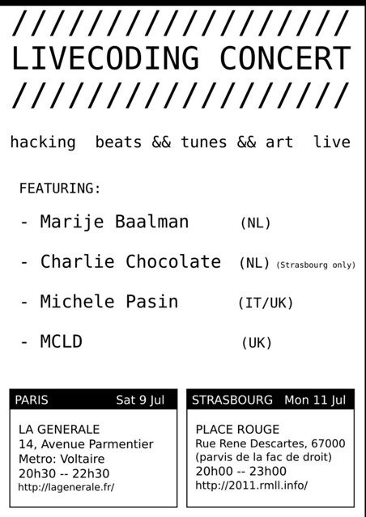

Two livecoding concerts coming up in the next days:

\- 9/7/11: A gig in Paris at [La Generale](http://lagenerale.fr/), "Laboratoire artistique, politique et social". 14, avenue Parmentier Paris XIe, Métro Voltaire ([facebook](http://www.facebook.com/event.php?eid=238044802881179) | [lastfm](http://www.last.fm/event/1989879+Livecoding+concert))

\- 11/7/11: A workshop+gig at the [2011 Libre Software Meeting](http://2011.rmll.info/?lang=en) in Stransbourg ([event page](http://2011.rmll.info/Programme-du-festival?lang=en) | [facebook](http://www.facebook.com/event.php?eid=247195045307080) | [lastfm](http://www.last.fm/event/1989716+Livecoding+concert)).

I'm going to play a new livecoded song called '**Fjords**'. During the last days I've also finalized several little things that make livecoding with Impromptu faster (and easier, at least for me), which is good, so I'm aiming at making available those too in the coming days...

Btw I'll try to take videos of the various performances, so stay tuned!        

\[**Update 11/7/11**\] Here's a recording of the **Paris** gig:

<iframe width="640" height="390" src="http://www.youtube.com/embed/Gh6TuUkeBZw" frameborder="0" allowfullscreen></iframe>
