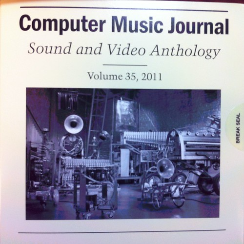
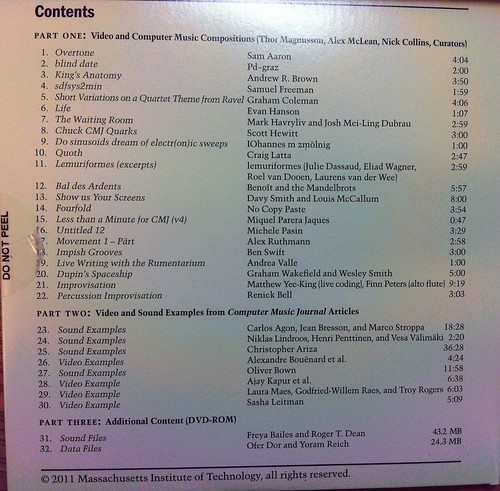

The latest issue of the [Computer Music Journal](http://www.mitpressjournals.org/loi/comj?ai=sj&mi=0&af=R) is now available, and it includes a DVD full of livecoding bonanza.

> Because this is the [Winter issue](http://www.mitpressjournals.org/toc/comj/35/4), it includes the annual CMJ DVD, whose program notes appear near the end of the issue. The curators for the compositions on this year’s DVD are specialists in live coding, the practice of onstage computer programming whose real-time output is an improvised and often collaborative musical performance. As always, the DVD also includes sound and video examples to accompany recent articles, as well as related files on the DVD-ROM portion of the disc.

A full description of the contents of the DVD is available [here](http://muse.jhu.edu/journals/computer_music_journal/v035/35.4.notes.html) (and [here](http://www.mitpressjournals.org/doi/abs/10.1162/COMJ_x_00112) if you're not benefitting from an academic subscription), and I'm very proud to say that it includes also one of my livecoding pieces, [Untitled 12](http://www.michelepasin.org/music/atmevent/), performed live at the Anatomy Museum livecoding event in 2010.

<iframe width="560" height="315" src="https://www.youtube.com/embed/8GHclRJAoE0" title="YouTube video player" frameborder="0" allow="accelerometer; autoplay; clipboard-write; encrypted-media; gyroscope; picture-in-picture" allowfullscreen></iframe>

