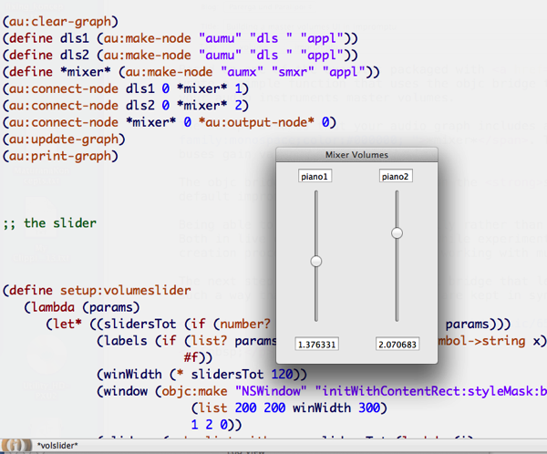

Based on one of the examples packaged with [Impromptu](http://impromptu.moso.com.au/), I wrote a simple function that uses the objc bridge to create a bare-bones user interface for adjusting your audio instruments master volumes.

## Using the `objc` bridge

The script assumes that your audio graph includes a mixer object called \*mixer\*. The UI controllers are tied to that mixer's input buses gain value.

The objc bridge commands are based on the **silly-synth example** that comes with the default impromptu package.

Being able to control volumes manually rather than programmatically made a great difference for me. Both in live coding situations and while experimenting on my own, it totally speeds up the music creation process and the ability of working with multiple melodic lines.

The next step would be to add a midi bridge that lets you control the UI using an external device, in such a way that the two controllers are kept in sync too. Enjoy!

P.s.: this is included in the [https://github.com/lambdamusic/ImpromptuLibs](https://github.com/lambdamusic/ImpromptuLibs)
