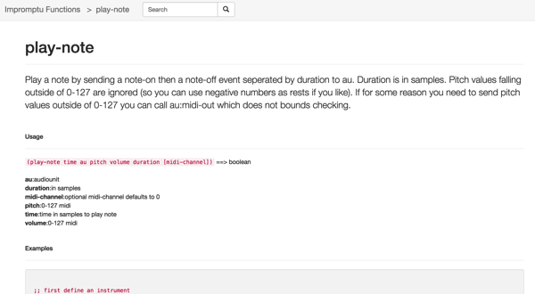

For all Impromptu aficionados: a little online application that can be used to search&browse the language documentation: [http://hacks.michelepasin.org/impromptu/](http://hacks.michelepasin.org/impromptu/)

## Why the docs

[Impromptu](http://impromptu.moso.com.au/) is a [scheme](http://en.wikipedia.org/wiki/Scheme_%28programming_language%29)\-based **OSX programming language** and environment for composers, sound artists, VJ’s and graphic artists with an interest in live or interactive programming.

As part of its original website, Impromptu included a **wiki** containing documentation and examples. Unfortunately the wiki isn't available online anymore, which is a real shame so the other day I've decided to replace it with a simple searchable index of the programming language functions. This is based on the documentation file coming with the latest Impromptu release (2.5); so, in theory, it shouldn't be too different from the original wiki site.

For those of you who are new to all of this, it's worth mentioning that Impromptu is now being superseded by the [Extempore](http://extempore.moso.com.au/) programming language.

Extempore is much more solid and feature rich; also, it is less dependent on the OS X platform APIs. Still, many of the original Impromptu scheme functions are still available, so this documentation could turn out to be useful too.

Enjoy!
