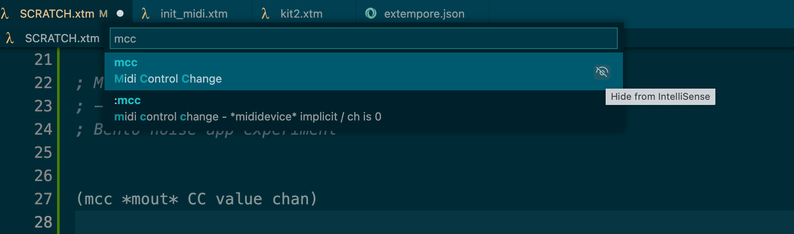

Extempore's [VSCode plugin](https://github.com/extemporelang/vscode-extempore) is really useful, but sometimes you may not want to use all the snippets that come with it. 

## Hiding snippets 

Here's a handy tip on how to hide snippets selectively: 

> you can hide specific snippets from showing in IntelliSense (completion list) by selecting the **Hide from IntelliSense** button to the right of snippet items in the **Insert Snippet** command dropdown.

See also: https://code.visualstudio.com/docs/editor/userdefinedsnippets#_can-i-remove-snippets-from-intellisense