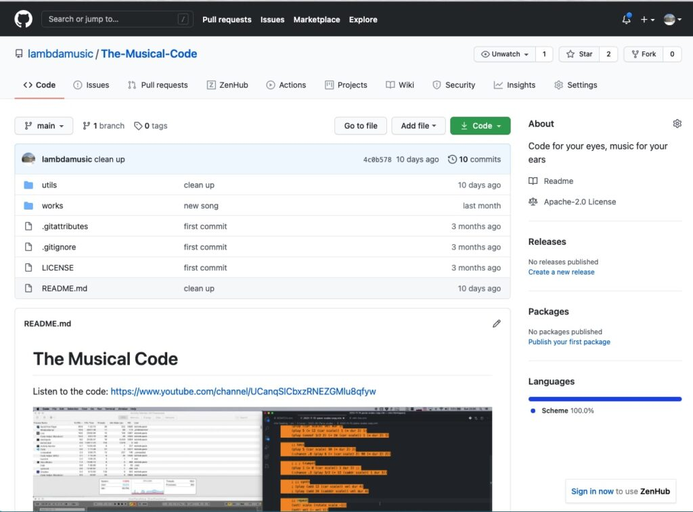
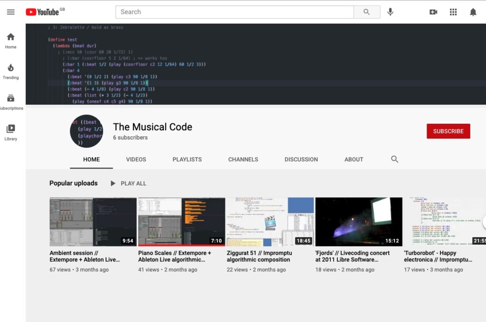

I've started a new *livecoding* project on Github called [The Musical Code](https://github.com/lambdamusic/The-Musical-Code). Plan is to add experimental musical code/algorithms created via the amazing [Extempore](https://extemporelang.github.io/) programming language (as well as it precursor [Impromptu](http://impromptu.moso.com.au/)).

Background: I have accumulated *so much* musical-code ideas over the years... so I've finally resolved to clean it up, reorganise it and publish it somewhere. 

[Github](https://github.com/lambdamusic/The-Musical-Code) seemed the best option, these days.

## Code + Video 

I soon realised that just **the code by itself won't do it**. Especially considering that the environments I used to 'run it' (and to make it go 'beep') could rapidly disappear: become obsolete, or get out of fashion!

Hence there's a [YouTube channel](https://www.youtube.com/channel/UCanqSICbxzRNEZGMlu8qfyw) as well, where one can find a screencast recording of each of the 'musical codes'.

