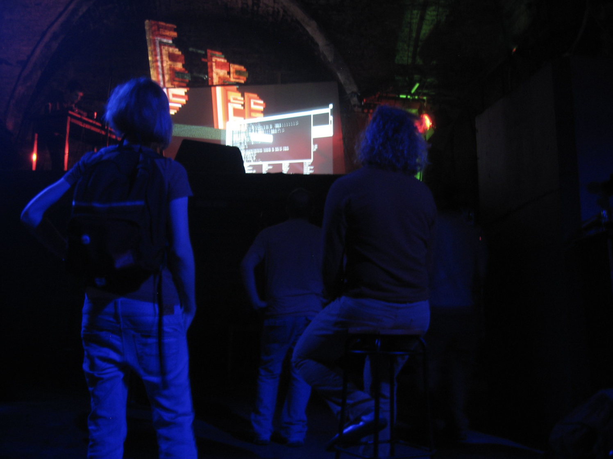

# Welcome

This site is devoted to the art of livecoding and algorithmic composition. 

!!! info

    This site is under development

## About me

My name is [Michele Pasin](https://www.michelepasin.org) and I love tinkering with real-time computer languages that can produce music, mostly using the **Impromptu** and its successor **Extempore** languages. 

In this blog I report on musical compositions and experiments I've made, interesting livecoding resources and occasionally other inspiring stuff from the creative world. 

## About Livecoding

> Live coding (sometimes referred to as 'on-the-fly programming', 'just in time programming' and related term 'live programming') is a programming practice centred upon the use of improvised interactive programming. Live coding is often used to create sound and image based digital media, and is particularly prevalent in computer music, combining algorithmic composition with improvisation.

-- Wikipedia [*https://en.wikipedia.org/wiki/Live_coding*](https://en.wikipedia.org/wiki/Live_coding)

{width=70%}

## The Extempore language

I've been using mainly Extempore to create musical algorithms. 

[Extempore](https://extemporelang.github.io/) is a programming language and runtime environment designed by [Andrew Sorensen](https://twitter.com/digego?lang=en) to support livecoding and cyberphysical programming, where a human programmer operates as an active agent in the world.

<iframe width="560" height="315" src="https://www.youtube.com/embed/yY1FSsUV-8c?controls=0" title="YouTube video player" frameborder="0" allow="accelerometer; autoplay; clipboard-write; encrypted-media; gyroscope; picture-in-picture" allowfullscreen></iframe>

## The Impromptu language

Impromptu was the OSX-only predecessor of Extempore.

> [Impromptu](http://impromptu.moso.com.au/) is an OSX programming language and environment for composers, sound artists, VJ's and graphic artists with an interest in live or interactive programming. Impromptu is a Scheme language environment, a member of the Lisp family of languages. Impromptu is used by artist-programmers in livecoding performances around the globe.

