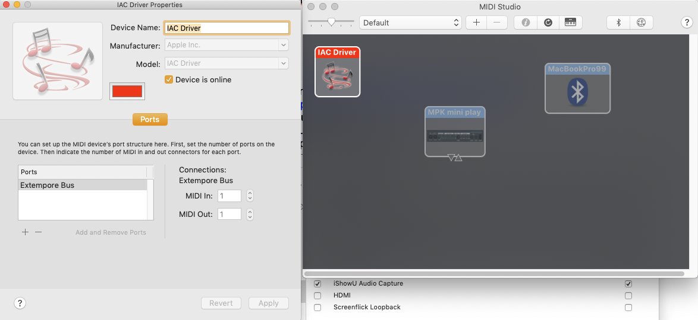
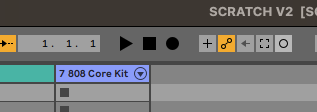
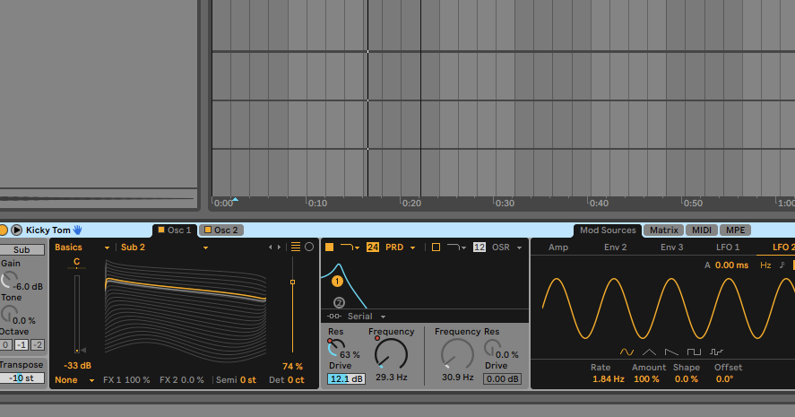
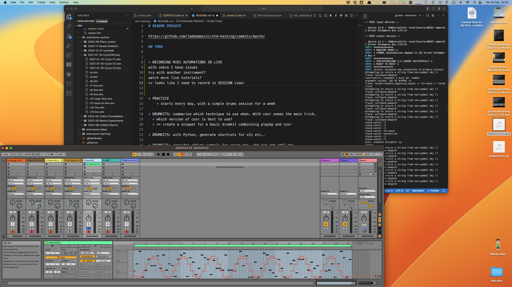

# Ableton Live

!!! note "In a nutshell"
    Extempore can generate musical events using MIDI and an external software sequencer like Ableton LIVE. This page shows how to control Ableton LIVE using Extempore.

## Controlling Ableton Live via MIDI

Mains steps: 

1. Create a new virtual device using the Audio Midi Setup app 
2. Restart Ableton LIVE, open preferences and add a Control Surface for extempore. Ensure INPUT sections 'Track' and Remote' are on.
3. Start Extempore, init MIDI and `(pm_print_devices)` to see what device number Ableton is on, then do the usual `(define *mididevice* (pm_create_output_stream <number>))` 

See also

- [A thread on MIDI setup on the Extempore mailing list](https://groups.google.com/g/extemporelang/c/9cQqmflEdpY/m/vej0rEw-AQAJ)


### OSX Audio Midi Setup

1. Open up Audio Midi Setup app; click on submenu `Show Midi Studio`
2. Double click on IAC driver and add a new entry called 'Extempore BUS' (any name would do). Save and close.

[](../assets/images/live-audio-midi-setup.png)

See also:

- [Ableton: MIDI setup help](https://help.ableton.com/hc/en-us/articles/209774225-Setting-up-a-virtual-MIDI-bus)
- [Apple: Set up MIDI devices using Audio MIDI Setup on Mac](https://support.apple.com/en-gb/guide/audio-midi-setup/ams875bae1e0/mac)


### Ableton MIDI settings

[](../assets/images/live-ableton-settings.png)

Restart Ableton LIVE, open preferences and add a **Control Surface** for extempore. Ableton Live you can you can [create your own MIDI mappings script](https://help.ableton.com/hc/en-us/articles/209774285-Using-Control-Surfaces) so I did one and named it 'extempore' - as a result the name appears in the dropdown in the *Control Surfaces* section.

Note: this is an extra step, extempore-live midi communication will work even without the script (using default settings). 

Then, on the **MIDI Ports Input** section: 

* Set `Track`, `Sync` and `Remote` inputs to true 
* Ready to go! (route extempore MIDI to it)

Important Note: _Only activate necessary MIDI ports!_

Switching Sync to On for both In and Out of the same device may trigger a feedback loop and affect Live’s performance. Do not do this unless you have a specific reason. 

See also

- [Ableton: MIDI ports help](https://help.ableton.com/hc/en-us/articles/209774205-Live-s-MIDI-Ports-Explained )


### Extempore MIDI messages 

Start Extempore, init MIDI and `(pm_print_devices)` to see what device number Ableton is on, then do the usual `(define *mididevice* (pm_create_output_stream <number>))`. 


!!! warning "Channels numbers"
    MIDI channels a 1-based in Live, but are 0-based in Extempore! So adjust your function calls accorindingly.

You can also refer to the device using its name:

```scheme

(define *DEFAULT_MIDI_DEVICE_NAME* 
  "IAC Driver Extempore Bus")

(sys:load_verbose "libs/external/portmidi.xtm")  ;; core midi lib
(pm_initialize)

(pm_print_devices)

(define *mididevice* (pm_create_output_stream 
  (pm_output_device_with_name *DEFAULT_MIDI_DEVICE_NAME*)))

;;;;;;;;;;;;;;;;;;;;;;;;;;;;;;;;;;;;;;;;;;;;;;;;;
;;
;; TEST PLAY NOTES
;;
;;;;;;;;;;;;;;;;;;;;;;;;;;;;;;;;;;;;;;;;;;;;;;;;;
(let ((beat (*metro* 'get-beat))
      (midichannel 1))
  (play midichannel 60 90 2)
)

```

See also 

* My own [Extempore startup script](https://github.com/lambdamusic/extempore-extensions/blob/main/LOAD_ALL.xtm) the snippet above is taken from
* Source code: [pm_output_stream function](https://extempore.michelepasin.org/def/pm_create_output_stream.html) and [portmidi.xtm](https://github.com/digego/extempore/blob/v0.8.9/libs/external/portmidi.xtm)


## Using Midi CC and Automations

### Arm the track 

From  'arrangement view' or 'session view'. 
Click on the automation arm button to ensure it's selected. 

Arm the track(s) you want to record on.

In Extempore, make sure you have MIDI CC mappings set up for the instrument you are using. 

Click on "Record"


*Note:* you'll always record in the arrangement view using this method. You can also record session clips, buy you need to select the Record Session button instead, and subsequently record an arrangements from the sessions




### Send Midi 

From Extempore

Eg

```scheme
(define channel 1)

; first set up the mapping as usual
; (:midicc 15 (random 1 100))


(define testmidicc
	(lambda (beat dur)

		;; play a note at each beat
		(at 1 0 (play channel C3 20 dur ))
		;; change CC every time the function runs
		(:midicc 15 (cosr (cosr 16 10 1/2) 5 .05))
	
	(callback (*metro* (+ beat (* 1/2 dur)))
		'testmidicc (+ beat dur) dur)))

(testmidicc (*metro* 'get-beat 1) 1/8)
```


You should see the MIDI CC effects in real time - eg if we mapped filter-1 to `Frequency` : 




### Stop recording

Always better to stop sending MIDI from Extempore first, to avoid strascichi di note. 

Once that is done, stop recording in Live. 

You should have a brand new clip in the armed tracks in the Arrangement view.


!!! warning
    In Ableton's MIDI settings, do not set the `Output` to IAC Driver! Leave it to `None`. Otherwise the track recording seems to fail as the record button always switches back to inactive. 


### Did it work? 

This is what automations look like in Ableton




### See Also

- [How to Record Automation in Ableton Live](https://support.native-instruments.com/hc/en-us/articles/210313785-How-to-Record-Automation-in-Ableton-Live) 